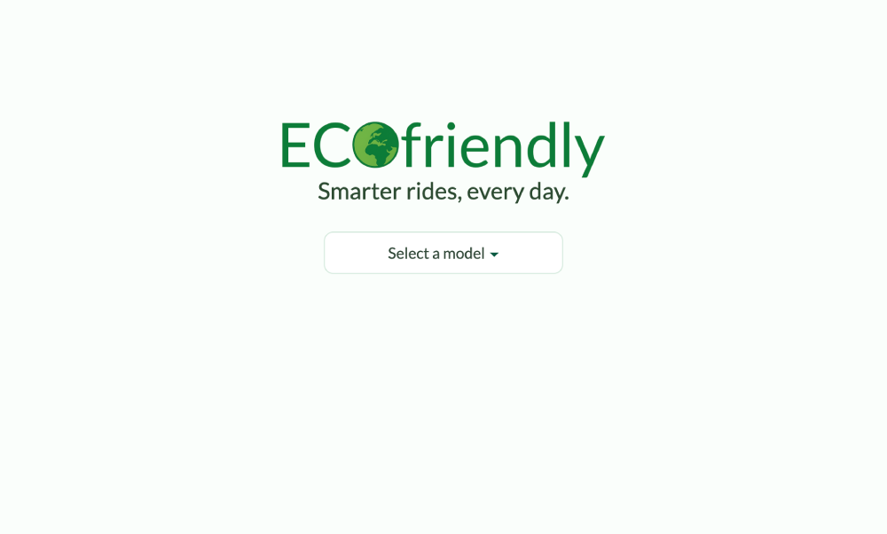

## Ecofriendly

AI-powered eco driving companion built with Angular and Firebase.  
Select your car model and year to generate a personalized sustainability report, track CO₂ savings, and get real-time green driving tips.

Live App: https://eco-eye.web.app  
 Git Repo: https://github.com/Toulouse6/eco-eye

---

### Stack

- Angular 15.2.0  
- Firebase Hosting  
- Firebase Functions (Node.js 20)  
- Firestore 
- Express + CORS  
- OpenAI GPT-4 API  
- TypeScript  
- Geolocation API  

---

**Author**: Tal Argaman
